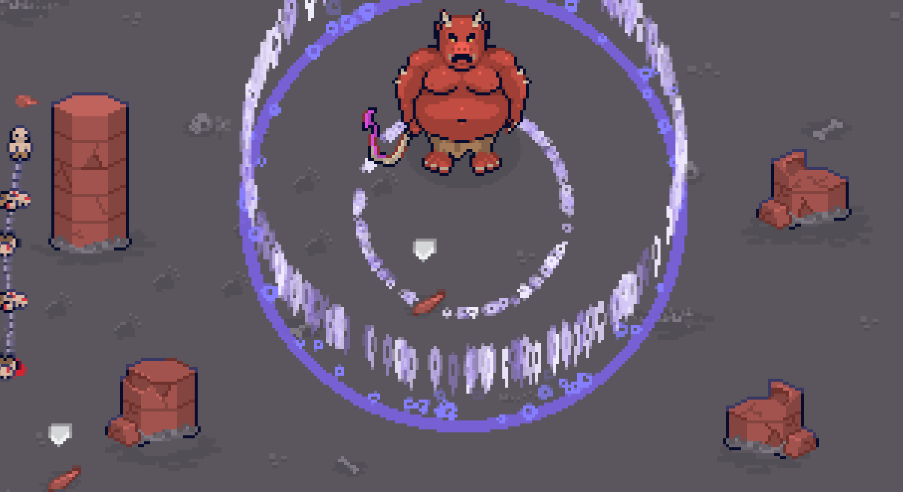

# Chains of Darnation: Escape from Heck
A 2-day project made for the GMTK 21 Game Jam (Theme: Joined Together)

Play as a group of chained Darned sent to Heck for their sins. Fight your way out by tricking the denizen of the realm.

**Control Info:**

* WASD / Arrow Keys : movement
* Space : attack (once you have picked up a weapon)

**Tips:**

Position yourself such that the demon hits the pillars with his line attack.  
Take the shard dropped by the pillar and use it to aggravate the demon.  
Rinse and repeat.

**Screenshots:**  

  
  

**Credits:**

* Sound effects from zapsplat.com and soundbible.com 
* Music: "Destructing Own Kingdom" by XTaKeRuX, licenced under CC BY 4.0 (https://creativecommons.org/licenses/by/4.0/legalcode), Obtained from freemusicarchive.org
